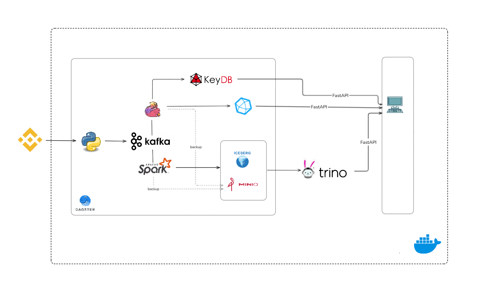

# Crypto Real-Time Data Platform

Dự án streaming giá crypto real-time từ Binance WebSocket, xử lý bằng Flink + Spark theo kiến trúc **Lambda** (speed layer + batch layer).

- **Speed layer** (Flink): Kafka → KeyDB + InfluxDB — phục vụ dashboard real-time, cache nóng, time-series chart
- **Batch layer** (Spark): Kafka → Iceberg trên MinIO — lưu trữ dài hạn, phân tích lịch sử
- **Query**: Trino SQL trực tiếp lên Iceberg
- **Orchestration**: Dagster tự động chạy backfill, aggregation, maintenance

---

## Kiến trúc

```
Binance WebSocket ──→ Producer ──→ Kafka (4 topics) ──┬──→ Flink ──→ KeyDB (real-time cache)
                                                       │            ──→ InfluxDB (time-series)
                                                       │
                                                       └──→ Spark Streaming ──→ Iceberg (MinIO)
                                                                                    │
                                                                               Trino (SQL)

Dagster (scheduled):
  02:00 AM ── backfill_historical.py ──→ InfluxDB + Iceberg
  03:00 AM ── iceberg_maintenance.py ──→ Compact/Expire Iceberg
  04:00 AM ── aggregate_candles.py   ──→ 1m→1h InfluxDB + Iceberg
```



## Yêu cầu

- Docker Desktop >= 4.x (WSL2)
- RAM: 16 GB+ (khuyến nghị 20 GB)
- Disk: 20 GB free
- CPU: 6 cores+

## Khởi động

```powershell
# 1. Build & start toàn bộ 14 services
docker compose up -d --build

# 2. Submit Flink streaming job (6 writer: ticker/kline/indicator/depth → KeyDB + InfluxDB)
docker exec flink-jobmanager flink run -d -py /app/src/ingest_flink_crypto.py

# 3. Submit Spark streaming job (3 query: ticker/trades/klines → Iceberg)
docker exec spark-master /opt/spark/bin/spark-submit \
  --master spark://spark-master:7077 \
  --packages "org.apache.iceberg:iceberg-spark-runtime-3.5_2.12:1.5.2,org.apache.iceberg:iceberg-aws-bundle:1.5.2,org.apache.hadoop:hadoop-aws:3.3.4,org.postgresql:postgresql:42.7.2,org.apache.spark:spark-sql-kafka-0-10_2.12:3.5.5" \
  --conf spark.driver.memory=2g --conf spark.executor.memory=2g \
  /app/src/ingest_crypto.py

# 4. (Tuỳ chọn) Backfill dữ liệu lịch sử ngay, nếu không thì 2h sáng Dagster tự chạy
docker exec spark-master /opt/spark/bin/spark-submit \
  --master spark://spark-master:7077 \
  --packages "org.apache.iceberg:iceberg-spark-runtime-3.5_2.12:1.5.2,org.apache.iceberg:iceberg-aws-bundle:1.5.2,org.apache.hadoop:hadoop-aws:3.3.4,org.postgresql:postgresql:42.7.2" \
  --conf spark.driver.memory=2g --conf spark.executor.memory=2g \
  /app/src/backfill_historical.py --mode all --iceberg-mode incremental
```

> Bước 2-3 submit streaming job thủ công (chạy liên tục, không qua Dagster). Bước 4 chạy 1 lần để nạp dữ liệu lịch sử, sau đó Dagster tự chạy lại lúc 2:00 AM hằng ngày.

## Tài khoản truy cập

| Service          | URL                      | Username     | Password       |
|:-----------------|:-------------------------|:-------------|:---------------|
| InfluxDB         | http://localhost:8086    | `admin`      | `adminpass123` |
| MinIO Console    | http://localhost:9001    | `minioadmin` | `minioadmin`   |
| PostgreSQL       | localhost:5432           | `iceberg`    | `iceberg123`   |
| Flink UI         | http://localhost:8081    | —            | —              |
| Spark Master UI  | http://localhost:8082    | —            | —              |
| Spark History    | http://localhost:18080   | —            | —              |
| Trino UI         | http://localhost:8083    | (any)        | —              |
| Dagster UI       | http://localhost:3000    | —            | —              |
| KeyDB            | localhost:6379           | —            | —              |
| Kafka            | localhost:9092           | —            | —              |

## Cấu trúc thư mục

```
cryptoprice_local/
├── docker-compose.yml              # 14 services
├── .env                            # Secrets (INFLUX_TOKEN, MINIO, POSTGRES)
├── spark-defaults.conf             # Spark config
├── src/
│   ├── producer_binance.py         # [Auto] Binance WS → Kafka
│   ├── ingest_flink_crypto.py      # [Manual] Flink: Kafka → KeyDB + InfluxDB
│   ├── ingest_crypto.py            # [Manual] Spark Streaming: Kafka → Iceberg
│   ├── backfill_historical.py      # [Dagster 02:00] Backfill InfluxDB + Iceberg
│   ├── aggregate_candles.py        # [Dagster 04:00] Gộp nến 1m → 1h
│   ├── iceberg_maintenance.py      # [Dagster CN 03:00] Compact/expire Iceberg
│   ├── backfill_influx.py          # (legacy) Đã merge vào backfill_historical
│   └── ingest_historical_iceberg.py# (legacy) Đã merge vào backfill_historical
├── orchestration/
│   ├── assets.py                   # Dagster: 3 assets + 3 schedules
│   └── workspace.yaml
└── docker/
    ├── flink/                      # Dockerfile + flink-conf.yaml
    ├── dagster/                    # Dockerfile + dagster.yaml
    ├── producer/                   # Dockerfile
    ├── trino/etc/                  # Trino config + Iceberg catalog
    ├── spark/                      # Dockerfile
    └── postgres/init.sql           # Init iceberg_catalog + dagster DB
```

## Chi tiết từng file

### `src/producer_binance.py` — Quad-Stream Producer

Tự chạy khi `docker compose up`. Kết nối **7 WebSocket** tới Binance cho **400 symbols USDT**, đẩy vào 4 Kafka topics:

| Stream | Kafka Topic | Dữ liệu | Tần suất |
|:-------|:------------|:---------|:---------|
| Ticker | `crypto_ticker` | Giá, bid/ask, volume 24h, % thay đổi | ~2s/symbol |
| Trades | `crypto_trades` | Giao dịch aggregated (price, qty, buyer/seller) | Real-time |
| Klines | `crypto_klines` | Nến OHLCV 1 phút (open, high, low, close, volume) | Mỗi giây + khi đóng nến |
| Depth  | `crypto_depth` | Order book 20 levels bid/ask | 100ms |

Giới hạn 200 symbols/connection để tránh bị Binance rate-limit (502). Tự reconnect khi mất kết nối.

### `src/ingest_flink_crypto.py` — Flink Streaming Job

Submit thủ công 1 lần, chạy liên tục. Đọc từ 3 Kafka topics, chạy **6 writer song song**:

| Writer | Input | Output | Chức năng |
|:-------|:------|:-------|:----------|
| `KeyDBWriter` | crypto_ticker | `ticker:latest:{symbol}` | Cache giá real-time (hash) + lịch sử 200 tick (sorted set) |
| `InfluxDBWriter` | crypto_ticker | `market_ticks` measurement | Time-series giá cho Grafana/chart |
| `KeyDBKlineWriter` | crypto_klines | `candle:latest:{symbol}` + `candle:history:{symbol}` | Cache nến mới nhất + lịch sử nến (sorted set) |
| `InfluxDBKlineWriter` | crypto_klines | `candles` measurement | Time-series nến OHLCV |
| `IndicatorWriter` | crypto_klines (closed) | `indicator:latest:{symbol}` + `indicators` measurement | Tính SMA20, SMA50, EMA12, EMA26 từ giá đóng nến. Ghi cả KeyDB và InfluxDB |
| `DepthWriter` | crypto_depth | `orderbook:{symbol}` | Top 20 bid/ask + best_bid/ask + spread. TTL 60s |

### `src/ingest_crypto.py` — Spark Streaming to Iceberg

Submit thủ công 1 lần, chạy liên tục. Đọc 3 Kafka topics, ghi vào **3 bảng Iceberg** trên MinIO:

| Query | Kafka Topic | Iceberg Table | Ghi chú |
|:------|:------------|:--------------|:--------|
| ticker_query | crypto_ticker | `coin_ticker` | ~1M rows/giờ |
| trades_query | crypto_trades | `coin_trades` | ~2M rows/giờ |
| klines_query | crypto_klines | `coin_klines` | 400 rows/phút (mỗi symbol 1 nến) |

Schema: `iceberg.crypto_lakehouse.*` — query bằng Trino tại http://localhost:8083.

### `src/backfill_historical.py` — Unified Backfill

Gộp chức năng cũ của `backfill_influx.py` + `ingest_historical_iceberg.py`. Hỗ trợ 3 mode:

| Mode | Chức năng |
|:-----|:----------|
| `--mode influx` | Phát hiện khoảng trống dữ liệu InfluxDB (do tắt máy), fill bằng Binance REST API |
| `--mode iceberg` | Kéo klines lịch sử từ Binance → Iceberg. `--iceberg-mode backfill` kéo từ 2017, `incremental` kéo từ nến cuối |
| `--mode all` | Chạy cả hai (mặc định khi Dagster gọi lúc 02:00 AM) |

### `src/aggregate_candles.py` — Candle Aggregation

Gộp nến 1 phút → 1 giờ để giảm dữ liệu phình. Chạy trên cả 2 layer:

- **InfluxDB**: Đọc `candles` interval=1m cũ hơn 7 ngày → aggregate OHLCV theo giờ → ghi `interval=1h` → xoá 1m cũ
- **Iceberg**: Spark SQL aggregate `coin_klines` → `coin_klines_hourly` → xoá record 1m cũ

Dagster tự chạy lúc 04:00 AM hàng ngày.

### `src/iceberg_maintenance.py` — Iceberg Table Maintenance

Chạy 4 tác vụ bảo trì trên tất cả bảng Iceberg:

1. **Compact small files** → gộp thành file ~128 MB
2. **Rewrite manifests** → giảm metadata overhead
3. **Expire snapshots** → xoá snapshot cũ hơn 48h
4. **Remove orphan files** → dọn file không còn tham chiếu

Dagster tự chạy Chủ Nhật lúc 03:00 AM.

### `orchestration/assets.py` — Dagster Orchestration

Định nghĩa 3 asset + 3 schedule:

| Asset | Schedule | Chức năng |
|:------|:---------|:----------|
| `backfill_historical` | 02:00 AM hàng ngày | Gọi `backfill_historical.py --mode all --iceberg-mode incremental` |
| `aggregate_candles` | 04:00 AM hàng ngày | Gọi `aggregate_candles.py --mode all` |
| `iceberg_table_maintenance` | 03:00 AM Chủ Nhật | Gọi `iceberg_maintenance.py` |

Tất cả chạy qua `spark-submit` trên Spark cluster.

### Legacy files (có thể xoá)

| File | Lý do |
|:-----|:------|
| `backfill_influx.py` | Chức năng đã merge vào `backfill_historical.py --mode influx` |
| `ingest_historical_iceberg.py` | Chức năng đã merge vào `backfill_historical.py --mode iceberg` |

## Dữ liệu lưu ở đâu?

| Database | Vai trò | Dữ liệu | Key/Measurement |
|:---------|:--------|:---------|:----------------|
| **KeyDB** | Cache real-time | 400 symbols | `ticker:latest:*`, `candle:latest:*`, `indicator:latest:*`, `orderbook:*` |
| **InfluxDB** | Time-series | Biểu đồ, Grafana | `market_ticks`, `candles`, `indicators` |
| **Iceberg** (MinIO) | Data lake | Lưu trữ dài hạn | `coin_ticker`, `coin_trades`, `coin_klines`, `coin_klines_hourly` |
| **Trino** | SQL query | Query Iceberg | `iceberg.crypto_lakehouse.*` |
| **Postgres** | Metadata | Dagster + Iceberg catalog | Nội bộ |

## Phân bổ tài nguyên

| Service            | Image                        | RAM (config) | RAM (thực tế) | CPU  | Ghi chú                                      |
|:-------------------|:-----------------------------|-------------:|---------------:|-----:|:----------------------------------------------|
| kafka              | apache/kafka:3.9.0           |       1.5 GB |        ~600 MB |  1.0 | KRaft mode, JVM heap ~1 GB                    |
| minio              | minio/minio:latest           |       1.0 GB |        ~300 MB |  0.5 | S3-compatible object storage                  |
| minio-init         | minio/mc:latest              |      64.0 MB |         ~30 MB |  0.1 | One-shot, tạo bucket rồi thoát               |
| influxdb           | influxdb:2.7                 |       1.5 GB |        ~500 MB |  0.5 | Time-series, org=vi, bucket=crypto            |
| postgres           | postgres:16-alpine           |     512.0 MB |        ~200 MB |  0.5 | Iceberg catalog + Dagster metadata            |
| keydb              | eqalpha/keydb:latest         |     512.0 MB |        ~150 MB |  0.5 | Redis-compatible in-memory cache              |
| flink-jobmanager   | cryptoprice/flink:1.18.1     |       1.6 GB |         ~1.6 GB |  1.0 | `jobmanager.memory.process.size: 1600m`       |
| flink-taskmanager  | cryptoprice/flink:1.18.1     |       1.7 GB |         ~1.7 GB |  1.0 | `taskmanager.memory.process.size: 1728m`      |
| spark-master       | apache/spark:3.5.5           |       1.0 GB |        ~400 MB |  0.5 | Chỉ schedule, không chạy task                 |
| spark-worker       | apache/spark:3.5.5           |       4.0 GB |         ~3.5 GB |  2.0 | `SPARK_WORKER_MEMORY=3G`, 2 cores             |
| trino              | trinodb/trino:442            |       2.0 GB |         ~1.5 GB |  1.0 | JVM `-Xmx2G`, query Iceberg trên MinIO       |
| dagster-webserver  | cryptoprice/dagster:latest   |       1.0 GB |        ~500 MB |  0.5 | UI + metadata queries                         |
| dagster-daemon     | cryptoprice/dagster:latest   |     512.0 MB |        ~300 MB |  0.5 | Scheduler loop                                |
| producer           | cryptoprice-producer         |     256.0 MB |        ~100 MB |  0.2 | Python WebSocket client                       |
|                    |                              |              |                |      |                                               |
| **TỔNG**           |                              | **~17.2 GB** |  **~11.4 GB**  | **9.3** |                                            |

> Nếu máy chỉ có 16 GB RAM: tắt Trino (`docker compose stop trino`) giảm ~2 GB.

## Lệnh thường dùng

```bash
# Quản lý
docker compose stop                  # Dừng (giữ data)
docker compose down -v               # Xoá hết (kể cả data)
docker compose logs -f <service>     # Xem log
docker compose restart <service>     # Restart 1 service

# Kiểm tra dữ liệu
docker exec keydb redis-cli HGETALL "ticker:latest:BTCUSDT"
docker exec keydb redis-cli HGETALL "indicator:latest:BTCUSDT"
docker exec keydb redis-cli HKEYS "orderbook:BTCUSDT"
docker exec trino trino --execute "SELECT count(*) FROM iceberg.crypto_lakehouse.coin_ticker"

# Kafka topics
docker exec kafka /opt/kafka/bin/kafka-topics.sh --list --bootstrap-server kafka:9092
```
