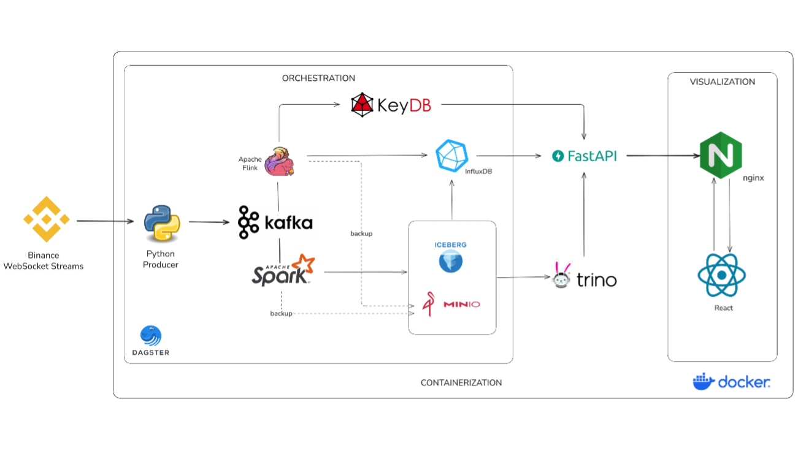

# Crypto Real-Time Data Platform 🚀

[](docker-compose.yml)
[](backend/)
[](frontend/)
[](src/processing/)
[](docker-compose.yml)

Dự án streaming giá crypto real-time từ Binance WebSocket, xử lý bằng Flink + Spark theo kiến trúc **Lambda** (speed layer + batch layer), phục vụ qua FastAPI + React dashboard.

- **Speed layer** (Flink): Kafka → KeyDB + InfluxDB — phục vụ dashboard real-time, cache, time-series chart
- **Batch layer** (Spark): Kafka → Iceberg trên MinIO — lưu trữ dài hạn, phân tích lịch sử
- **Query**: Trino SQL trực tiếp lên Iceberg
- **Orchestration**: Dagster tự động chạy backfill, aggregation, maintenance
- **Serving layer**: FastAPI (REST + WebSocket) → Nginx reverse proxy → React SPA

---

## Kiến trúc



```
Dagster (scheduled):
  Manual/On-demand ── src/batch/backfill.py ──→ InfluxDB + Iceberg
  03:00 AM ── src/batch/maintenance.py ──→ Compact/Expire Iceberg
  04:00 AM ── src/batch/aggregate.py   ──→ 1m→1h InfluxDB + Iceberg
```

## Yêu cầu

- Docker Engine >= 24.x hoặc Docker Desktop >= 4.x
- RAM: 16 GB+ (khuyến nghị 32 GB — hiện deploy trên **t3a.2xlarge**: 8 vCPU AMD, 32 GB RAM)
- Disk: 50 GB+ free (hiện 100 GB gp3)
- CPU: 4 cores+ (khuyến nghị 8 cores)

## Khởi động

```powershell
# 0. Tạo file .env từ template (sửa mật khẩu cho phù hợp)
cp .env.example .env
# Mở .env và thay đổi các giá trị mật khẩu/token

# 1. Build & start toàn bộ 21 services
docker compose up -d --build

# 2. Submit Flink streaming job (6 writer: ticker/kline/indicator/depth → KeyDB + InfluxDB)
docker exec flink-jobmanager flink run -d -py /app/src/processing/pipeline.py --pyFiles /app/src

# 3. Submit Spark streaming job (3 query: ticker/trades/klines → Iceberg)
docker exec -d spark-master /opt/spark/bin/spark-submit \
  --master spark://spark-master:7077 \
  --packages "org.apache.spark:spark-sql-kafka-0-10_2.12:3.5.5,org.apache.spark:spark-avro_2.12:3.5.5,org.apache.iceberg:iceberg-spark-runtime-3.5_2.12:1.7.1,org.apache.hadoop:hadoop-aws:3.3.4,com.amazonaws:aws-java-sdk-bundle:1.12.262" \
  --conf spark.cores.max=2 \
  /app/src/lakehouse/pipeline.py

# 4. Nạp dữ liệu lịch sử lần đầu (90 ngày)
docker compose run --rm influx-backfill python /app/src/batch/backfill.py --mode populate --days 90

# 5. (Tuỳ chọn) Chạy incremental backfill ngay (thay vì đợi Dagster 2:00 AM)
docker exec spark-master /opt/spark/bin/spark-submit \
  --master spark://spark-master:7077 \
  --packages "org.apache.iceberg:iceberg-spark-runtime-3.5_2.12:1.5.2,org.apache.iceberg:iceberg-aws-bundle:1.5.2,org.apache.hadoop:hadoop-aws:3.3.4,org.postgresql:postgresql:42.7.2" \
  --conf spark.driver.memory=2g --conf spark.executor.memory=2g \
  /app/src/batch/backfill.py --mode all --iceberg-mode incremental
```

> Bước 2-3 submit streaming job thủ công (chạy liên tục, không qua Dagster). Bước 4 chạy 1 lần để nạp dữ liệu lịch sử, sau đó Dagster tự chạy lại lúc 2:00 AM hằng ngày.

## Tài khoản truy cập

> Tất cả credentials được cấu hình trong file `.env` (xem `.env.example`). Bảng dưới là giá trị mặc định.

| Service              | URL                    | Username             | Password                 |
| :------------------- | :--------------------- | :------------------- | :----------------------- |
| InfluxDB             | http://localhost:8086  | `$INFLUX_ADMIN_USER` | `$INFLUX_ADMIN_PASSWORD` |
| MinIO Console        | http://localhost:9001  | `$MINIO_ROOT_USER`   | `$MINIO_ROOT_PASSWORD`   |
| PostgreSQL           | localhost:5432         | `$POSTGRES_USER`     | `$POSTGRES_PASSWORD`     |
| Flink UI             | http://localhost:8081  | —                    | —                        |
| Spark Master UI      | http://localhost:8082  | —                    | —                        |
| Spark History        | http://localhost:18080 | —                    | —                        |
| Trino UI             | http://localhost:8083  | (any)                | —                        |
| Dagster UI           | http://localhost:3000  | —                    | —                        |
| KeyDB                | localhost:6379         | —                    | —                        |
| Kafka                | localhost:9092         | —                    | —                        |
| **Nginx (Frontend)** | http://localhost:80    | —                    | —                        |
| **FastAPI**          | http://localhost:8080  | —                    | —                        |

## Cấu trúc thư mục

```
cryptoprice_local/
├── docker-compose.yml              # 21 services
├── .env                            # Secrets (gitignored)
├── .env.example                    # Template — copy sang .env rồi sửa
├── spark-defaults.conf             # Spark config
├── src/
│   ├── producer/main.py            # [Auto] Binance WS → Kafka
│   ├── processing/pipeline.py      # [Manual] Flink: Kafka → KeyDB + InfluxDB
│   ├── lakehouse/pipeline.py       # [Manual] Spark Streaming: Kafka → Iceberg
│   ├── batch/backfill.py           # [Manual] Backfill InfluxDB + Iceberg
│   ├── batch/aggregate.py          # [Dagster 04:00] Gộp nến 1m → 1h
│   ├── batch/maintenance.py        # [Dagster CN 03:00] Compact/expire Iceberg
│   ├── common/                     # Shared infrastructure (Kafka, Avro, config, logging)
│   └── exchanges/                  # Exchange abstractions (Binance, etc.)
├── backend/                        # FastAPI serving layer (MVC Architecture)
│   ├── app.py                      # App + lifespan + CORS + health check
│   ├── core/                       # Biến môi trường, database connections
│   ├── models/                     # Pydantic schemas
│   ├── services/                   # Business logic (candle_service)
│   └── api/                        # Route handlers
│       ├── klines.py               # GET /api/klines — nến OHLCV (KeyDB + InfluxDB)
│       ├── historical.py           # GET /api/klines/historical — nến lịch sử (Trino/Iceberg)
│       ├── ticker.py               # GET /api/ticker + /api/ticker/{symbol}
│       ├── orderbook.py            # GET /api/orderbook/{symbol}
│       ├── trades.py               # GET /api/trades/{symbol}
│       ├── symbols.py              # GET /api/symbols — danh sách coin
│       ├── indicators.py           # GET /api/indicators/{symbol} — SMA/EMA
│       └── websocket.py            # WS /api/stream?symbol=&interval= — streaming real-time
├── frontend/                       # React 19 SPA (Vite + TypeScript)
│   ├── src/
│   │   ├── App.tsx                 # Main dashboard layout
│   │   ├── components/             # Chart, OrderBook, RecentTrades, MarketSelector...
│   │   ├── services/               # API clients (marketDataService.ts)
│   │   └── types/                  # TypeScript interfaces
│   └── package.json
├── orchestration/
│   ├── assets.py                   # Dagster: 3 assets + 2 schedules
│   └── workspace.yaml
└── docker/
    ├── flink/                      # Dockerfile + flink-conf.yaml
    ├── dagster/                    # Dockerfile + dagster.yaml
    ├── producer/                   # Dockerfile
    ├── trino/etc/                  # Trino config + Iceberg catalog
    ├── spark/                      # Dockerfile
    ├── fastapi/                    # Dockerfile + requirements.txt
    ├── nginx/                      # Dockerfile (multi-stage build) + nginx.conf
    └── postgres/init.sql           # Init iceberg_catalog + dagster DB
```

## Chi tiết từng file

### `src/producer/main.py` — Quad-Stream Producer

Tự chạy khi `docker compose up`. Kết nối **7 WebSocket** tới Binance cho **400 symbols USDT**, đẩy vào 4 Kafka topics:

| Stream | Kafka Topic     | Dữ liệu                                           | Tần suất                |
| :----- | :-------------- | :------------------------------------------------ | :---------------------- |
| Ticker | `crypto_ticker` | Giá, bid/ask, volume 24h, % thay đổi              | ~2s/symbol              |
| Trades | `crypto_trades` | Giao dịch aggregated (price, qty, buyer/seller)   | Real-time               |
| Klines | `crypto_klines` | Nến OHLCV 1 giây (open, high, low, close, volume) | Mỗi giây + khi đóng nến |
| Depth  | `crypto_depth`  | Order book 20 levels bid/ask                      | 100ms                   |

Kafka: 3 partitions/topic, LZ4 compression, 48h retention.

Giới hạn 200 symbols/connection để tránh bị Binance rate-limit (502). Tự reconnect khi mất kết nối.

### `src/processing/pipeline.py` — Flink Streaming Job

Submit thủ công 1 lần, chạy liên tục. Đọc từ 3 Kafka topics, chạy **6 writer song song**:

| Writer                | Input                  | Output                                                 | Chức năng                                                                 |
| :-------------------- | :--------------------- | :----------------------------------------------------- | :------------------------------------------------------------------------ |
| `KeyDBWriter`         | crypto_ticker          | `ticker:latest:{symbol}`                               | Cache giá real-time (hash) + lịch sử 200 tick (sorted set)                |
| `InfluxDBWriter`      | crypto_ticker          | `market_ticks` measurement                             | Time-series giá cho Grafana/chart                                         |
| `KeyDBKlineWriter`    | crypto_klines          | `candle:1s:{symbol}` + `candle:1m:{symbol}` + `candle:latest:{symbol}` | Cache nến real-time (1s/1m) theo TTL                                      |
| `InfluxDBKlineWriter` | crypto_klines          | `candles` measurement                                  | Time-series nến OHLCV                                                     |
| `IndicatorWriter`     | crypto_klines (closed) | `indicator:latest:{symbol}` + `indicators` measurement | Tính SMA20, SMA50, EMA12, EMA26 từ giá đóng nến. Ghi cả KeyDB và InfluxDB |
| `DepthWriter`         | crypto_depth           | `orderbook:{symbol}`                                   | Top 20 bid/ask + best_bid/ask + spread. TTL 60s                           |

### `src/lakehouse/pipeline.py` — Spark Streaming to Iceberg

Submit thủ công 1 lần, chạy liên tục. Đọc 3 Kafka topics, ghi vào **3 bảng Iceberg** trên MinIO:

| Query        | Kafka Topic   | Iceberg Table | Ghi chú                          |
| :----------- | :------------ | :------------ | :------------------------------- |
| ticker_query | crypto_ticker | `coin_ticker` | ~1M rows/giờ                     |
| trades_query | crypto_trades | `coin_trades` | ~2M rows/giờ                     |
| klines_query | crypto_klines | `coin_klines` | 400 rows/phút (mỗi symbol 1 nến) |

Schema: `iceberg.crypto_lakehouse.*` — query bằng Trino tại http://localhost:8083.

### `src/batch/backfill.py` — Unified Backfill

Gộp chức năng cũ của `backfill_influx.py` + `ingest_historical_iceberg.py`. Hỗ trợ 3 mode:

| Mode             | Chức năng                                                                                                     |
| :--------------- | :------------------------------------------------------------------------------------------------------------ |
| `--mode influx`  | Phát hiện khoảng trống dữ liệu InfluxDB (do tắt máy), fill bằng Binance REST API                              |
| `--mode iceberg` | Kéo klines lịch sử từ Binance → Iceberg. `--iceberg-mode backfill` kéo từ 2017, `incremental` kéo từ nến cuối |
| `--mode all`     | Chạy cả hai (mặc định khi Dagster gọi lúc 02:00 AM)                                                           |

### `src/batch/aggregate.py` — Candle Aggregation

Gộp nến 1 phút → 1 giờ để giảm dữ liệu phình. Chạy trên cả 2 layer:

- **InfluxDB**: Đọc `candles` interval=1m cũ hơn 7 ngày → aggregate OHLCV theo giờ → ghi `interval=1h` → xoá 1m cũ
- **Iceberg**: Spark SQL aggregate `coin_klines` → `coin_klines_hourly` → xoá record 1m cũ

Dagster tự chạy lúc 04:00 AM hàng ngày.

### `src/batch/maintenance.py` — Iceberg Table Maintenance

Chạy 4 tác vụ bảo trì trên tất cả bảng Iceberg:

1. **Compact small files** → gộp thành file ~128 MB
2. **Rewrite manifests** → giảm metadata overhead
3. **Expire snapshots** → xoá snapshot cũ hơn 48h
4. **Remove orphan files** → dọn file không còn tham chiếu

Dagster tự chạy Chủ Nhật lúc 03:00 AM.

### `orchestration/assets.py` — Dagster Orchestration

Định nghĩa 3 asset + 2 schedule:

| Asset                       | Schedule           | Chức năng                                       |
| :-------------------------- | :----------------- | :---------------------------------------------- |
| `backfill_historical`       | **Chạy thủ công**  | Backfill InfluxDB gaps + Iceberg klines         |
| `aggregate_candles`         | 04:00 AM hàng ngày | Gọi `src/batch/aggregate.py --mode all`           |
| `iceberg_table_maintenance` | 03:00 AM Chủ Nhật  | Gọi `src/batch/maintenance.py`                    |

> **Lưu ý:** `backfill_historical` **không có schedule tự động**. Chỉ chạy thủ công khi cần (xem phần "Lệnh backfill thủ công" ở trên).

Tất cả chạy qua `spark-submit` trên Spark cluster.

### `backend/` — FastAPI Serving Layer (MVC Architecture)

Cung cấp REST API + WebSocket cho frontend. Kết nối 3 data source tuỳ theo loại truy vấn:

| Router          | Endpoint              | Data Source                  | Chức năng                                    |
| :-------------- | :-------------------- | :--------------------------- | :------------------------------------------- |
| `klines.py`     | `GET /api/klines`     | KeyDB (`1s`) → InfluxDB (`1m+`) → Trino/Iceberg (deep history) | Nến OHLCV + aggregate server-side |
| `historical.py` | `GET /api/klines/historical` | InfluxDB + Trino → Iceberg | Nến lịch sử theo khoảng ngày (tối đa 1 năm) |
| `ticker.py`     | `GET /api/ticker`, `GET /api/ticker/{symbol}` | KeyDB | Giá real-time (all symbols hoặc theo symbol) |
| `orderbook.py`  | `GET /api/orderbook/{symbol}` | KeyDB (+ fallback Binance REST) | Sổ lệnh 20 levels bid/ask |
| `trades.py`     | `GET /api/trades/{symbol}` | KeyDB                        | Tick history gần nhất                        |
| `symbols.py`    | `GET /api/symbols`    | KeyDB scan                   | Danh sách coin đang có dữ liệu               |
| `indicators.py` | `GET /api/indicators/{symbol}` | KeyDB                  | SMA20, SMA50, EMA12, EMA26                   |
| `websocket.py`  | `WS /api/stream?symbol=&interval=` | KeyDB              | Streaming nến real-time (500ms interval)     |

Health check: `GET /api/health` — ping KeyDB, InfluxDB, Trino.

### `frontend/` — React Dashboard

Giao diện TradingView-style, build bằng Vite + React 19 + TypeScript + lightweight-charts. Nginx phục vụ SPA tại port 80, proxy `/api/` tới FastAPI.

- **CandlestickChart**: Biểu đồ nến OHLCV real-time + lịch sử, hỗ trợ 8 timeframe (1s, 1m, 5m, 15m, 1H, 4H, 1D, 1W)
- **MarketSelector**: Tìm kiếm/chọn symbol động qua CoinGecko API, hiển thị giá + % thay đổi
- **OrderBook**: Sổ lệnh real-time với thanh depth
- **RecentTrades**: Giao dịch gần nhất, màu xanh/đỏ theo phía mua/bán
- **ErrorBoundary & ToastProvider**: Bắt lỗi toàn cục, hiển thị thông báo lỗi thân thiện

### `docker/nginx/` — Nginx Reverse Proxy

Multi-stage Dockerfile: build React app (Node 20) → copy vào nginx:1.25-alpine. Cấu hình:

- `/` → SPA (React, fallback `index.html`)
- `/api/` → proxy tới FastAPI (hỗ trợ WebSocket upgrade)
- Gzip enabled, static cache 1 năm

### Legacy files

Các file legacy đã được loại bỏ khỏi `src/` trong hiện trạng repository.

## Dữ liệu lưu ở đâu?

| Database            | Vai trò         | Dữ liệu                   | Key/Measurement                                                           |
| :------------------ | :-------------- | :------------------------ | :------------------------------------------------------------------------ |
| **KeyDB**           | Cache real-time | 400 symbols               | `ticker:latest:*`, `candle:1s:*`, `candle:1m:*`, `candle:latest:*`, `indicator:latest:*`, `orderbook:*` |
| **InfluxDB**        | Time-series     | 1m candles (retention 90d), indicators, market ticks | `market_ticks`, `candles`, `indicators`                                   |
| **Iceberg** (MinIO) | Data lake       | Lưu trữ dài hạn           | `coin_ticker`, `coin_trades`, `coin_klines`, `coin_klines_hourly`         |
| **Trino**           | SQL query       | Query Iceberg             | `iceberg.crypto_lakehouse.*`                                              |
| **Postgres**        | Metadata        | Dagster + Iceberg catalog | Nội bộ                                                                    |

## Phân bổ tài nguyên

| Service           | Image                      | RAM (config) | RAM (thực tế) |     CPU | Ghi chú                                             |
| :---------------- | :------------------------- | -----------: | ------------: | ------: | :--------------------------------------------------- |
| kafka             | apache/kafka:3.9.0         |       1.5 GB |       ~1.0 GB |     2.0 | KRaft mode, LZ4 compression, 48h retention           |
| minio             | minio/minio:latest         |       1.0 GB |        ~86 MB |     0.1 | S3-compatible object storage                         |
| minio-init        | minio/mc:latest            |           — |            — |      — | One-shot, tạo bucket rồi thoát (restart: no)         |
| influxdb          | influxdb:2.7               |       1.5 GB |       ~110 MB |     0.5 | Time-series, org=vi, bucket=crypto                   |
| postgres          | postgres:16-alpine         |     512.0 MB |        ~22 MB |     0.1 | Iceberg catalog + Dagster metadata                   |
| keydb             | eqalpha/keydb:latest       |       1.0 GB |        ~26 MB |     0.2 | maxmemory 1GB, LRU eviction, hz 50                   |
| flink-jobmanager  | cryptoprice/flink:1.18.1   |       2.3 GB |       ~448 MB |     0.5 | `jobmanager.memory.process.size: 2304m` (cap 2.5G)   |
| flink-taskmanager | cryptoprice/flink:1.18.1   |       6.0 GB |       ~2.2 GB |     3.0 | `process.size: 6144m`, 2 slots, parallelism=1        |
| spark-master      | apache/spark:3.5.5         |       1.0 GB |       ~764 MB |     0.3 | Chỉ schedule + driver                                |
| spark-worker      | apache/spark:3.5.5         |       4.0 GB |       ~244 MB |     0.1 | `SPARK_WORKER_MEMORY=4G`, cores.max=2                |
| trino             | trinodb/trino:442          |       1.0 GB |       ~1.1 GB |     0.5 | JVM `-Xmx1G`, query Iceberg (hiếm dùng)             |
| dagster-webserver | cryptoprice/dagster:latest |       1.0 GB |       ~203 MB |     0.5 | UI + metadata queries                                |
| dagster-daemon    | cryptoprice/dagster:latest |     512.0 MB |       ~274 MB |     0.5 | Scheduler loop                                       |
| producer          | cryptoprice-producer       |     256.0 MB |        ~77 MB |     1.5 | Python WebSocket client (4 WS threads)               |
| fastapi           | cryptoprice/fastapi        |     256.0 MB |       ~143 MB |     0.3 | Uvicorn 2 workers, REST API + WebSocket              |
| nginx             | nginx:1.25-alpine          |     128.0 MB |         ~7 MB |     0.1 | Reverse proxy + SPA + gzip                           |
|                   |                            |              |               |         |                                                      |
| **TỔNG**          |                            | **~18.5 GB** |   **~6.7 GB** | **9.4** | Trên t3a.2xlarge (8 vCPU, 32 GB RAM, 100 GB gp3)    |

> Nếu máy chỉ có 16 GB RAM: tắt Trino (`docker compose stop trino`) giảm ~1 GB.

## Lệnh thường dùng

```bash
# Quản lý
docker compose stop                  # Dừng (giữ data)
docker compose down -v               # Xoá hết (kể cả data)
docker compose logs -f <service>     # Xem log
docker compose restart <service>     # Restart 1 service

# Kiểm tra dữ liệu
docker exec keydb redis-cli HGETALL "ticker:latest:BTCUSDT"
docker exec keydb redis-cli HGETALL "indicator:latest:BTCUSDT"
docker exec keydb redis-cli HKEYS "orderbook:BTCUSDT"
docker exec trino trino --execute "SELECT count(*) FROM iceberg.crypto_lakehouse.coin_ticker"

# Kafka topics
docker exec kafka /opt/kafka/bin/kafka-topics.sh --list --bootstrap-server kafka:9092

# Serving layer
curl http://localhost:8080/api/health
curl http://localhost:8080/api/symbols
curl http://localhost:8080/api/ticker/BTCUSDT
curl "http://localhost:8080/api/klines?symbol=BTCUSDT&interval=1m&limit=100"
curl http://localhost:8080/api/orderbook/BTCUSDT
curl "http://localhost:8080/api/klines/historical?symbol=BTCUSDT&interval=1h&startTime=1704067200000&endTime=1706745600000&limit=500"
```
